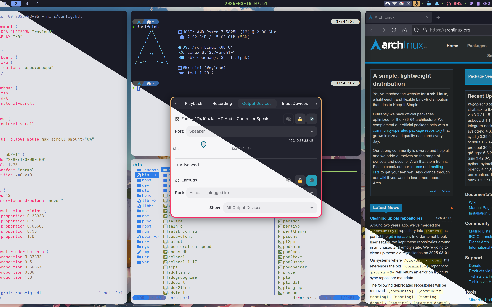
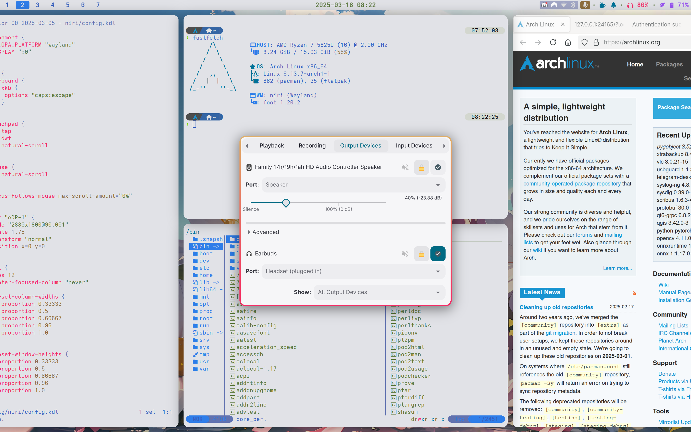
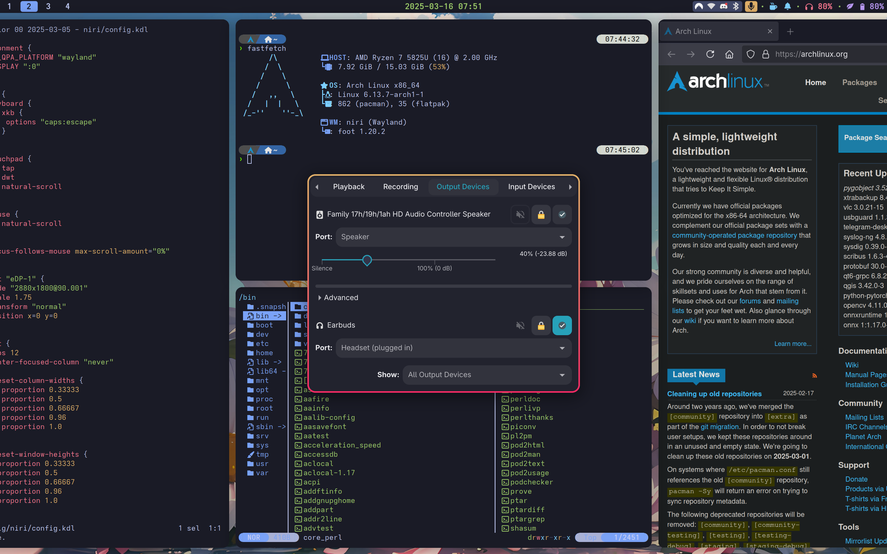
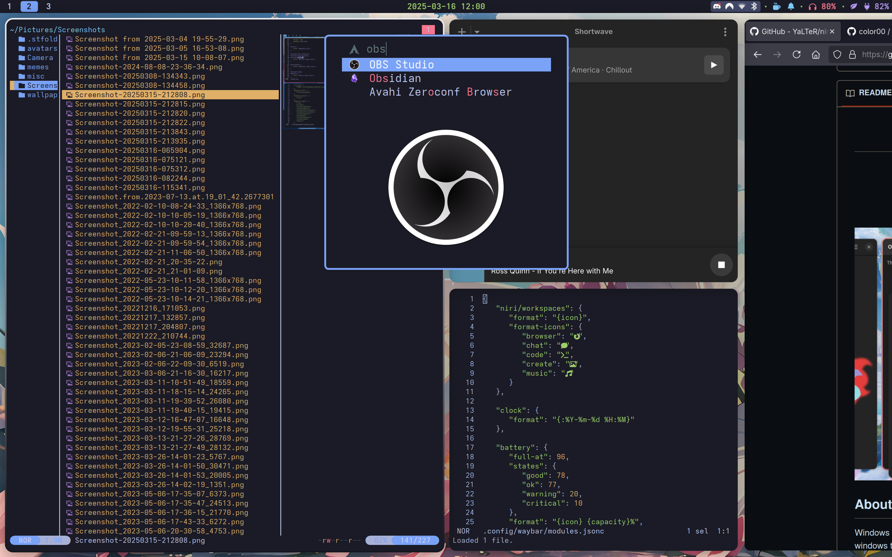

<div align="center">

### [color00](https://github.com/color00)'s Niri dotfiles for Arch Linux

  


  
  
  

  Screenshots: \[[01](assets/screenshot-01.png)\] \[[02](assets/screenshot-02.png)\] \[[03](assets/screenshot-03.png)\] \[[04](assets/screenshot-04.png)\] | [Project](https://github.com/color00/arch-niri-public) | [README](https://github.com/color00/arch-niri-public/blob/main/README.md)

</div>

---

Featuring:
- Application Launcher: [Fuzzel](https://codeberg.org/dnkl/fuzzel)
- File Manager: [Yazi](https://github.com/sxyazi/yazi)
- GTK Theme and Terminal Color Scheme: [Tokyonight](https://aur.archlinux.org/pkgbase/tokyonight-gtk-theme-git)
- Idle Management Daemon: [Swayidle](https://github.com/swaywm/swayidle)
- Notification Daemon: [Dunst](https://dunst-project.org) | [Dunst GitHub](https://github.com/dunst-project/dunst)
- Panel: [Waybar](https://github.com/Alexays/Waybar)
- Power Menu: [Wlogout](https://github.com/ArtsyMacaw/wlogout)
- Shell: [Fish](https://fishshell.com)
- Terminal Emulator: [Foot](https://codeberg.org/dnkl/foot)
- Text Editor: [Helix](https://helix-editor.com)
- Wallpaper Utility: [Swaybg](https://github.com/swaywm/swaybg) 
- Window Manger: [Niri](https://github.com/YaLTeR/niri) 
- Custom: [Scripts](.config/scripts)

List of all installed Arch packages and flatpaks can be found in the project [here](.config/current).

Fish shell terminal prompt configured with:
 - [Fisher](https://github.com/jorgebucaran/fisher)
 - [Tide](https://github.com/IlanCosman/tide)
```
curl -sL https://raw.githubusercontent.com/jorgebucaran/fisher/main/functions/fisher.fish | source && fisher install jorgebucaran/fisher
fisher install IlanCosman/tide@v6
tide configure
```

Before theme switching, please install the Tokyonight GTK theme and set "Tokyonight-Dark" or "Tokyonight-Light" GTK via:
```
gsettings set org.gnome.desktop.interface gtk-theme 'Tokyonight-Dark'
```
or
```
gsettings set org.gnome.desktop.interface gtk-theme 'Tokyonight-Light'
```

All of the work included in this repository is either directly created or heavily influenced by the code and creative efforts of the following projects/individuals:  
- [adi1090x](https://github.com/adi1090x) | [Archcraft](https://archcraft.io)
- [Hyprland](https://hyprland.org)
- [HyprNova](https://github.com/zDyanTB/HyprNova)
- [JaKooLit](https://github.com/JaKooLit/Arch-Hyprland)
- [MyLinuxForWork](https://github.com/mylinuxforwork/dotfiles) | [ML4W](https://www.ml4w.com)
- [Sway](https://swaywm.org)

Special thanks to [YaLTeR](https://github.com/YaLTeR) for creating the best window managrs I've ever seen.  
